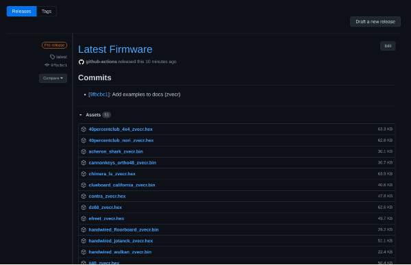

# QMK Userspace

> Cloud build your QMK keymaps

Easily keep all your keymaps in one place, no git rebase/merge hell, no need to upstream your keymaps, and automatic builds of everything you care about.

## Getting Started

1. Fork this template repo
1. Add keymap files
1. Wait for your firmware files to be automatically built for you!

For more detailed instructions, [view the full docs](.docs/README.md)

## Official Website

[qmk.fm](https://qmk.fm) is the official website of QMK, where you can find links to this page, the documentation, and the keyboards supported by QMK.
